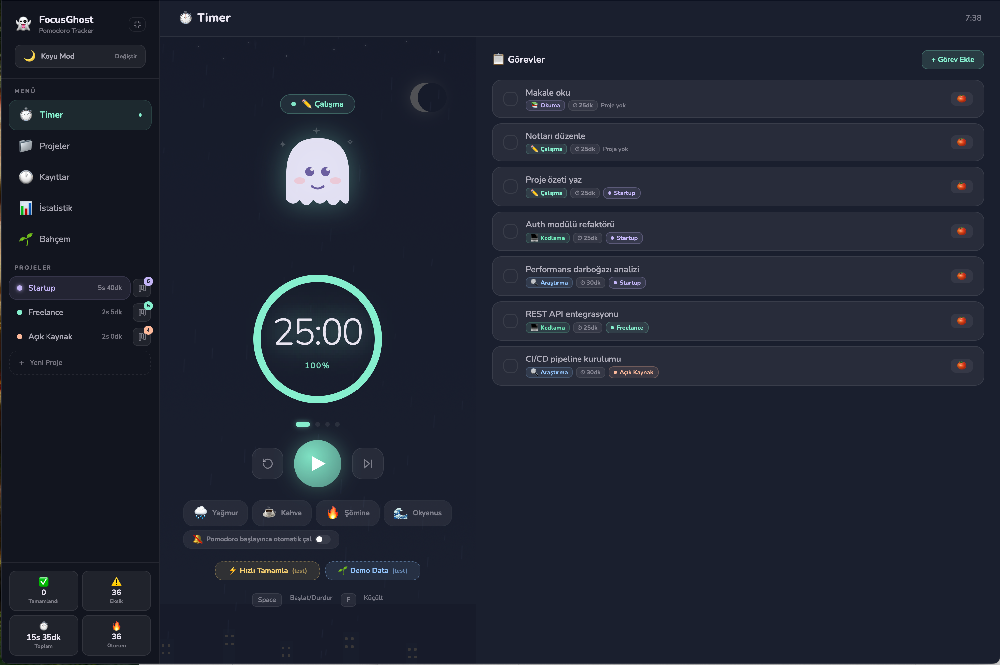
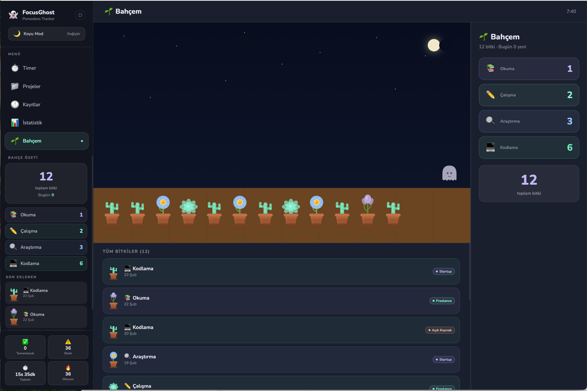
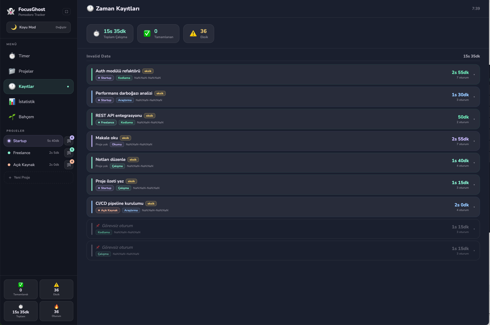
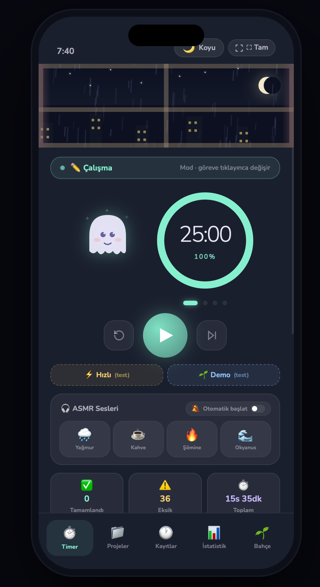

# 👻 FocusGhost

Pomodoro tekniği ile çalışma sürenizi takip edin, seans esnasında Ghost animasyonu size eşlik etsin. Projelerinizi ve görevlerinize ne kadar vakit harcadığınızı takip ederek deadline tahminlerinizi daha iyi yapın.

## ✨ Özellikler

- **Pomodoro Timer** — Farklı aktivite modları (Okuma 📚, Çalışma ✏️, Araştırma 🔍, Kodlama 💻)
- **Sanal Bahçe 🌱** — Her tamamlanan pomodoro için bahçenize bitki ekleyin
- **Proje & Görev Yönetimi**
  - Projelerinizi kaydedin ve organize edin
  - Görevleri projelere atayın
  - Tanımladığınız görevlere ne kadar vakit sarfettiğinizi görün
  - Bir görev üzerinde farklı günlerde çalışabilin
- **Kanban Board** — Trello-tarzı görev kartlarıyla projelerinizi Kanban board'da görüntüleyin
- **İstatistikler 📊** — Haftalık grafikler, aktivite ısı haritası, mod dağılımı
- **ASMR Sesler 🎧** — Yağmur, kahve dükkanı, şömine, okyanus sesleri
- **Tema Desteği** — Açık/Koyu mod
- **Responsive Tasarım** — Mobil ve masaüstü uyumlu

## 📸 Ekran Görüntüleri

<div align="center">

### Ana Ekran


### Odaklanma Modu (Mobil)


### Bahçe Görünümü


### Zaman Kayıtları


### Mobil Görünüm


</div>

## 🚀 Kurulum

```bash
# Bağımlılıkları yükle
npm install

# Geliştirme sunucusunu başlat
npm run dev

# Production build
npm run build
```

Uygulama http://localhost:5173 adresinde açılacaktır.

## 🛠️ Teknolojiler

- **React 18** — UI framework
- **Vite** — Build tool ve dev server
- **Web Audio API** — Prosedürel ASMR ses üretimi
- **Canvas API** — Yağmur animasyonu
- **localStorage** — Veri kalıcılığı

## 📂 Proje Yapısı

```
src/
├── App.jsx          # Ana uygulama mantığı
├── GhostSVG.jsx     # Ghost karakter animasyonları
├── PlantSVG.jsx     # Bitki ve bahçe SVG bileşenleri
├── constants.js     # Temalar, sabitler, yardımcı fonksiyonlar
└── main.jsx         # React root
```

## 🎨 Özellikler Detay

### Aktivite Modları
Her mod farklı renk ve animasyonla gelir:
- **📚 Okuma** — Lavanta rengi, kitap okuyan hayalet
- **✏️ Çalışma** — Yeşil, not alan hayalet  
- **🔍 Araştırma** — Mavi, büyüteç tutan hayalet
- **💻 Kodlama** — Turkuaz, laptop kullanan hayalet

### Bahçe Sistemi
Pomodoro tamamladıkça aktivite moduna göre farklı bitkiler kazanılır:
- Okuma → Lavanta 💜
- Çalışma → Sukulent 🌿
- Araştırma → Papatya 🌼
- Kodlama → Kaktüs 🌵

## 💾 Veri Yönetimi

Tüm verileriniz tarayıcınızın localStorage'ında saklanır:
- Projeler ve görevler
- Zaman kayıtları
- Bahçe bitkileri
- Özel pomodoro süreleri
- Kanban kartları

## 🤝 Katkıda Bulunma

Pull request'ler memnuniyetle karşılanır!

## 📝 Lisans

MIT

---
